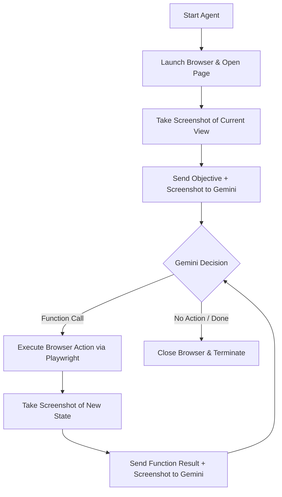

# Viva Presentation Guide: Website Automation Agent

This document serves as your complete guide to explaining, defending, and showcasing the **Website Automation Agent** project during your viva. It details what the project is, how it works under the hood, key architecture decisions, and potential viva questions (with answers).

---

## 1. Project Overview & Objective

### What is it?
An **autonomous visual web agent** built using **Node.js, TypeScript, Playwright, and Gemini 3.1 Flash-Lite**. 

### What does it do?
It takes a high-level natural language prompt (e.g., *"Go to the shadcn-ui documentation, find the form, and fill in the Bug Title field with 'Tori'"*), opens a real browser, inspects the page visually, decides on actions (such as clicking, typing, scrolling, or filling elements), and executes them step-by-step until the task is complete.

---

## 2. Core Architecture & Workflow

The agent runs in a closed-loop system of perception, reasoning, and action:

### Key Modules
1. **[index.ts](file:///d:/Projects/Website%20Automation%20Agent/src/index.ts)**: The entry point. Initializes the process, sets the user's objective, invokes the agent loop, and ensures clean cleanup of browser processes.
2. **[agent.ts](file:///d:/Projects/Website%20Automation%20Agent/src/agent.ts)**: The main execution loop. It handles LLM interaction, constructs the history payloads, processes function calls, handles retries, and maintains conversation state.
3. **[tools.ts](file:///d:/Projects/Website%20Automation%20Agent/src/tools.ts)**: The automation primitives using **Playwright**. Defines actions like `openBrowser`, `navigateToUrl`, `clickOnScreen(x, y)`, `sendKeys(text)`, `typeInField(label, text)`, and `scroll(direction, amount)`.

---

## 3. Key Design Decisions (Why & How)

### Decision A: Visual State Verification over DOM Parsing
* **Why?** Dynamic modern web frameworks (React, Angular, Svelte) and libraries (like TailwindCSS or CSS Modules) generate highly complex, nested, or randomized class names. Parsing the DOM is fragile, slow, and prone to breaking when layout changes.
* **How?** The agent operates primarily on **visual screenshots**. It sends the screenshot to Gemini, and Gemini uses visual/spatial reasoning to estimate coordinates on the page.
* **Advantage:** The agent is completely robust against changing class names and HTML structures. It "sees" the page exactly like a human user does.

### Decision B: Bypassing Chat SDK for Manual History Management
* **Why?** Standard SDK abstractions (like `chat.sendMessage()`) enforce strict turn-taking rules. They throw validation errors if you attempt to send a tool execution outcome and a brand new visual state (screenshot) in the same turn.
* **How?** The project manually manages the `history` array and passes it directly to `model.generateContent({ contents: history })`.
* **The "Alternating Roles" Hack:** Gemini requires that turns strictly alternate between `user` and `model`. To feed both a **Function Response** (User) and the **New Screenshot** (User) without causing consecutive user turns:
  1. User sends **Function Responses** (Playwright execution results).
  2. The code appends a **dummy model turn**: *"I have received the function execution results. Please provide the latest screenshot so I can verify the state."*
  3. User then sends the **New Screenshot** as the next turn.

### Decision C: Hybrid Selector Engine (`typeInField`)
* **Why?** Precise text insertion using absolute click coordinates `(x, y)` can sometimes be unstable due to DPI/resolution scaling differences or slight coordinate estimation errors from the LLM.
* **How?** Implemented `typeInField(label, text)`. It uses Playwright locators to find inputs/textareas by their associated user-visible labels, placeholders, or adjacent text layout (using a fallback XPath: `//label[contains(text(), '${label}')]/following::input[1]`).
* **Advantage:** Allows highly precise, bulletproof text entry on forms while maintaining visual-only navigation for general scrolling and browsing.

---

## 4. Viva Q&A (What, Why, How, When)

### Q1: Why did you choose Gemini 3.1 Flash-Lite?
* **Answer:** Gemini 3.1 Flash-Lite is natively multimodal (understands images/screenshots out of the box), supports native Function Calling (Structured Outputs), has a massive context window, and is fast and highly cost-effective compared to larger models like Gemini Pro or GPT-4o, making it ideal for high-throughput browser interaction loops.

### Q2: How does the model know exactly where to click (`x, y` coordinates)?
* **Answer:** Gemini uses its visual reasoning capabilities to map pixels. When we provide a screenshot, Gemini calculates the relative coordinates of the target element. Playwright then maps these coordinates onto the actual browser viewport and executes a click event.

### Q3: What if the browser window size changes? Does it break?
* **Answer:** Coordinates can be misaligned if scaling differs. In our implementation, we solved this by running a consistent default viewport size and adding `typeInField` to resolve form inputs by their visible labels instead of relying solely on raw coordinate clicks.

### Q4: How does the system handle error recovery (e.g., if a click fails)?
* **Answer:** 
  * Each tool execution has a **2-attempt retry loop**. If a Playwright action fails (e.g., trying to click before an element loads), it catches the warning and retries.
  * If it fails twice, a fatal error is thrown, and the `finally` block in `index.ts` automatically closes the browser to prevent orphaned browser processes.
  * Additionally, we track consecutive turns with no action. If Gemini does not call any function for **3 consecutive turns**, the loop terminates to prevent infinite execution and API token burn.

### Q5: How do you handle scrolling reliably?
* **Answer:** Initially, we scrolled using the mouse wheel at the cursor position (`page.mouse.wheel`). However, this was unstable if the cursor hovered over side panels or overlays. We optimized this to scroll the main document window viewport directly (`page.evaluate(() => window.scrollBy(...))`), ensuring consistent body scrolls.

### Q6: Can this agent log in to websites or bypass CAPTCHAs?
* **Answer:** It can type into username/password inputs using `sendKeys` or `typeInField`. However, it cannot bypass advanced CAPTCHAs (like reCAPTCHA or Cloudflare Turnstile) by design, as these are specifically engineered to block automated browser engines like Playwright.

---

## 5. Future Scope & Improvements

If asked how you would take this project further, you can suggest:

1. **Self-Healing Selector Logic:** If coordinate-based interactions fail, the system could automatically analyze the DOM around the click coordinate to generate a resilient selector.
2. **Interactive User-in-the-Loop:** For sensitive operations (like clicking "Submit" or making a payment), introduce a confirmation modal where the agent pauses and asks the user for approval.
3. **Session State Persistence:** Allow saving cookies/localStorage states so the agent doesn't need to log in from scratch on every run.

